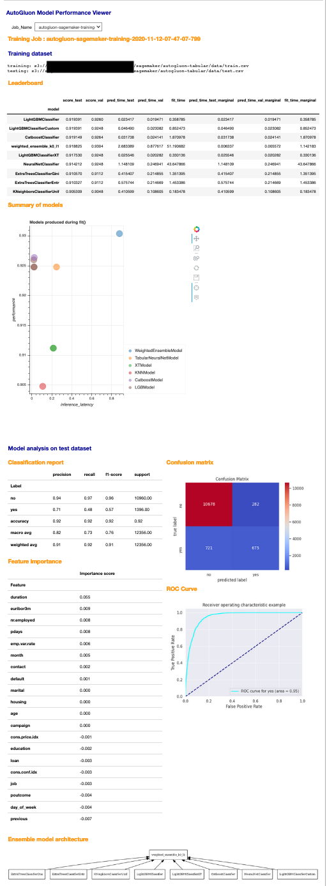

# AutoGluon Model Performance Viewer

This is a Jupyter notebook which retrieves AutoGluon Tabular training jobs in Amazon SageMaker, and to visualize the model training output and the performance on test dataset. 

In order to use this, you should train the model using autogluon-tabular found in [Amazon SageMaker examples GIT repo](https://github.com/aws/amazon-sagemaker-examples/tree/master/advanced_functionality/autogluon-tabular) It will create the below output files once the training is finished.

- leaderboard
- summary of models being trained
- visualized architecture of the ensemble model
- classification report, feature importance, confusion matrix, ROC curve for classification model

